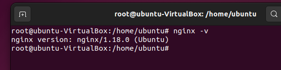
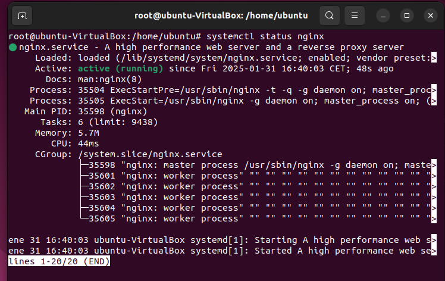
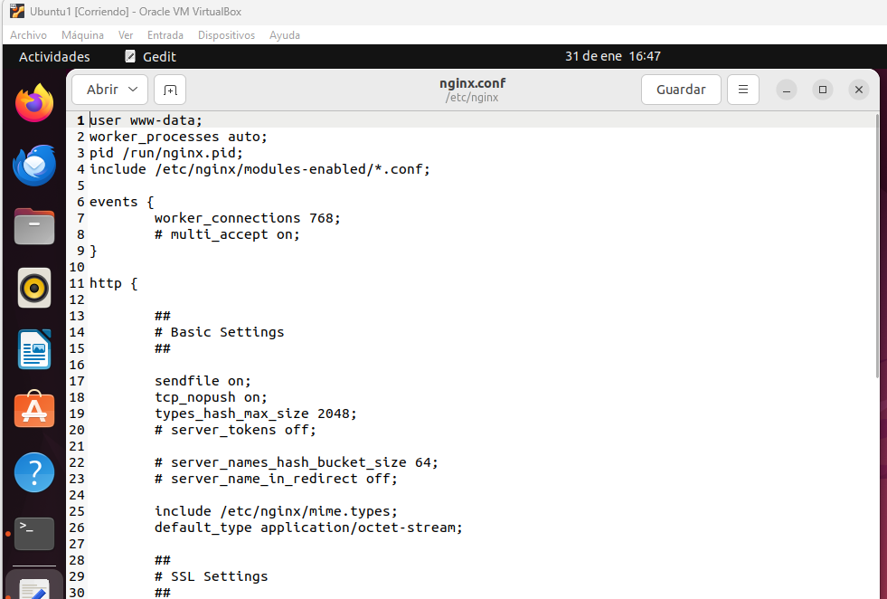
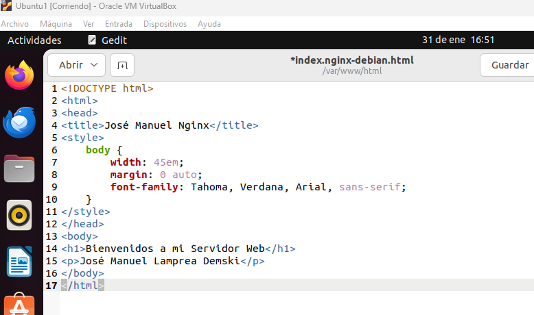
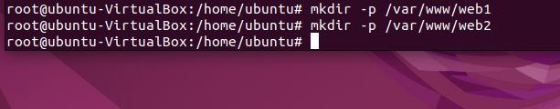
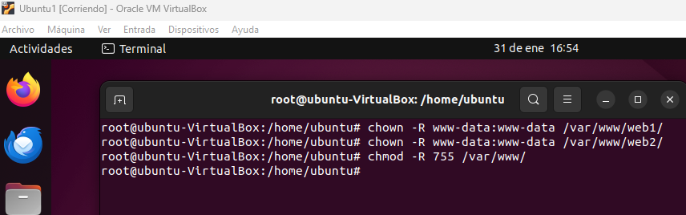

<h1 align="center"> CASOS PRÁCTICOS </h1>  
 
 

## ENUNCIADO  
Acabamos de terminar el CFGS ASIR y encuentramos trabajo en la empresa Servicios Web RC, SA en Huelva. Anteriormente utilzaban Apache como servidor web y quiere migrar a `Nginx`. Una vez instalado y configurado procedemos a realizar todos los casos prácticos solicitados.  
 
 

### 1) VERSIÓN DE NGINX QUE USAMOS 
Para ver la versión de Nginx hay que ejecutar en un terminal el siguiente comando
>nginx -v
 

### 2) COMPROBAR SERVICIO
Para ver si nuestro servicio esta en ejecución debemos usar le siguiente comando
>systemctl status nginx
 

### 3) FICHEROS DE CONFIGURACIÓN
El directorio donde podmeos encontrar el fichero de nginx esta situado en 
> /etc/nginx
 

El archivo de configuración de nginx es 
>nginx.conf
 

### 4) CAMBIAR HTML DE LA PAGINA WEB PRINCIPAL
Para ello debemos modificar el archivo
>/var/www/html/index.nginx-debian.html
 

### 5) VIRTUAL HOSTING
Crearemos dos sitios webs llamados `web1` y `web2`
- Debemos crear primero los directorios
 

- Conceder permisos
 

