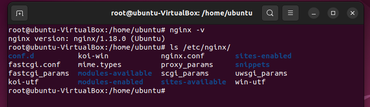
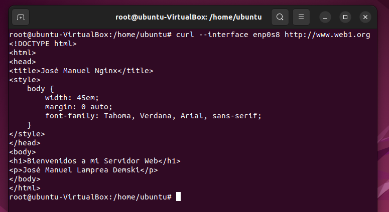

<h1 align="center"> CASOS PRÁCTICOS </h1>  
 
 

## ENUNCIADO  
Acabamos de terminar el CFGS ASIR y encuentramos trabajo en la empresa Servicios Web RC, SA en Huelva. Anteriormente utilzaban Apache como servidor web y quiere migrar a `Nginx`. Una vez instalado y configurado procedemos a realizar todos los casos prácticos solicitados.  
 
 

### 1) VERSIÓN DE NGINX QUE USAMOS 
Para ver la versión de Nginx hay que ejecutar en un terminal el siguiente comando
>nginx -v
 

### 2) COMPROBAR SERVICIO
Para ver si nuestro servicio esta en ejecución debemos usar le siguiente comando
>systemctl status nginx
 

### 3) FICHEROS DE CONFIGURACIÓN
El directorio donde podmeos encontrar el fichero de nginx esta situado en 
> /etc/nginx
 

El archivo de configuración de nginx es 
>nginx.conf
 

### 4) CAMBIAR HTML DE LA PAGINA WEB PRINCIPAL
Para ello debemos modificar el archivo
>/var/www/html/index.nginx-debian.html
 

### 5) VIRTUAL HOSTING
Crearemos dos sitios webs llamados `web1` y `web2`
- Debemos crear primero los directorios
 

- Conceder permisos
 

- Crear `index.html` de `web1` y `web2`
 

- Creación de los `sites-available` para cada web
 

- Configuración del archivo hosts para las webs
 

- Verificación de entrada en las webs
 

### 6) AUTENTICACIÓN, AUTORIZACIÓN Y CONTROL DE ACCESO
Mientras que la `web1` puede acceder por la red externa como por la interna, la `web2` solo puede por la interna, arreglemos esto con unos sencillos pasos

- Modificar los `sites-available` de cada web
 

 

- Modificar el archivo `hosts` con las ips de ambas web
 

- Comprobemos la red interna usando el comando
>curl
 

  

- Comprobemos ahora la red
 

 

### 7) AUTENTICACIÓN, AUTORIZACIÓN Y CONTROL DE ACCESO
Vamos a restringir Web1.org de tal forma que solo puedan acceder a la web usuarios con su contraseña

- Creamos el `usuario1` con su respectiva contraseña para poder entrar en la `web1`
- Modificaremos el archivo `sites-available`
 

- Verificamos que web1 ahora es privado y solo podemos acceder a el mediante el `usuario1` que hemos creado antes y su contraseña
 

### 8) AUTENTICACIÓN, AUTORIZACIÓN Y CONTROL DE ACCESO
La web1 contiene un directorio creado llamado `privada` donde la red externa pide autorización y desde la red interna no.

- Debemos volver a modificar el archivo `sites-available`
 

### 9) SEGURIDAD
Configuremos `web1` para que el acceso sea seguro, para ello debemos crear una `key` privada mediante el siguiente comando

>openssl req -x509 -nodes -days 365 -newkey rsa:2048 -keyout /etc/ssl/private/selfigned.key -out /etc/ssl/certs/selfsigned.crt
 

- Para acabar debemos volver a modificar el archivo `sites-available`
 

