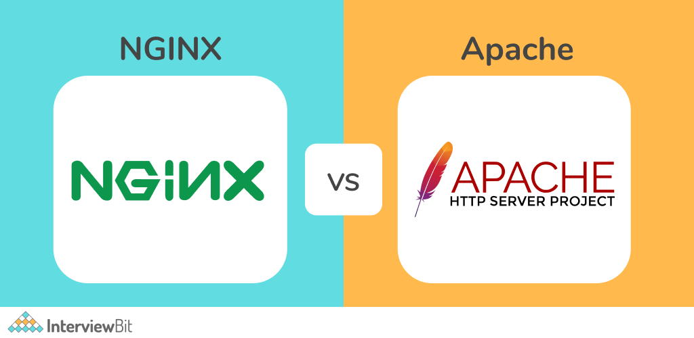

<h1 align="center"> COMPARATIVA CON APACHE </h1>
 
 

# NGINX vs Apache: Comparación y Puntos Claves

Tanto **NGINX** como **Apache** son dos de los servidores web más populares y ampliamente utilizados en la actualidad. Ambos tienen sus ventajas y desventajas según el caso de uso y las necesidades específicas del proyecto. A continuación, se presenta una comparación entre ambos, destacando los aspectos más importantes.

## 1. Arquitectura

### NGINX
- **Arquitectura asíncrona y basada en eventos**: NGINX maneja las conexiones de manera asíncrona y no bloqueante, lo que le permite manejar un gran número de conexiones simultáneas con un bajo consumo de recursos.
- **Eficiencia**: Está optimizado para servir contenido estático y manejar un alto tráfico con menos uso de CPU y memoria.

### Apache
- **Arquitectura basada en procesos/hilos**: Apache puede utilizar diferentes modelos de procesamiento (Multi-Processing Modules o MPMs), como **prefork**, **worker** y **event**. El modelo predeterminado (prefork) crea un nuevo proceso para cada conexión, lo que consume más recursos comparado con la arquitectura de NGINX.
- **Flexibilidad**: Aunque Apache puede ser configurado para manejar múltiples conexiones de manera eficiente, su enfoque de creación de procesos/hilos puede ser menos eficiente en entornos de alto tráfico.

## 2. Manejo de conexiones simultáneas

### NGINX
- **Gran capacidad para manejar conexiones concurrentes**: Gracias a su arquitectura asíncrona, NGINX puede manejar miles de conexiones simultáneas sin consumir grandes cantidades de recursos.
- **Ideal para servidores con tráfico masivo**: NGINX es excelente para sitios web y aplicaciones que requieren un alto rendimiento con muchas conexiones activas, como sitios de medios y plataformas de streaming.

### Apache
- **Limitaciones en configuraciones predeterminadas**: Apache puede manejar conexiones simultáneas, pero su enfoque basado en procesos/hilos requiere más recursos y no es tan eficiente en entornos con mucho tráfico.
- **Mejora con el MPM Event**: Apache ha mejorado su capacidad para manejar múltiples conexiones simultáneas con el MPM Event, aunque NGINX sigue siendo más eficiente en este aspecto.

## 3. Servir contenido estático vs dinámico

### NGINX
- **Optimizado para contenido estático**: NGINX es extremadamente rápido al servir contenido estático (imágenes, CSS, JavaScript) directamente desde el sistema de archivos.
- **Proxy inverso**: NGINX está diseñado para trabajar como un proxy inverso y distribuir las solicitudes a otros servidores de aplicaciones para generar contenido dinámico (PHP, Node.js, etc.).

### Apache
- **Mejor manejo de contenido dinámico**: Apache tiene una integración más nativa con los módulos de procesamiento de lenguajes dinámicos como PHP (a través de mod_php), lo que lo hace ideal para aplicaciones web dinámicas como WordPress y otros CMS.
- **Capacidad de manejar tanto contenido estático como dinámico**: Apache es capaz de manejar ambos tipos de contenido, aunque no está tan optimizado para contenido estático como NGINX.

## 4. Configuración y módulos

### NGINX
- **Configuración basada en bloques**: NGINX usa un archivo de configuración en formato simple y estructurado con bloques (`server`, `location`), lo que facilita la gestión de múltiples configuraciones.
- **Soporte limitado para módulos dinámicos**: NGINX tiene soporte para módulos dinámicos, pero no es tan extensible como Apache. Los módulos deben ser seleccionados y compilados durante la instalación.

### Apache
- **Configuración más flexible**: Apache utiliza archivos de configuración más detallados (como `.htaccess`), lo que permite una configuración por directorio y mayor personalización.
- **Amplia gama de módulos**: Apache es altamente modular, permitiendo cargar y descargar módulos dinámicamente sin necesidad de recompilar. Tiene soporte para muchos más módulos que NGINX, lo que le otorga flexibilidad para proyectos complejos.

## 5. Rendimiento

### NGINX
- **Rendimiento superior en cargas altas**: En condiciones de alto tráfico, NGINX es más eficiente que Apache, especialmente para servir contenido estático o como proxy inverso.
- **Bajo uso de recursos**: NGINX utiliza menos memoria y CPU para manejar muchas conexiones, lo que lo hace ideal para sistemas con recursos limitados.

### Apache
- **Rendimiento aceptable en entornos de baja a media carga**: Para sitios con tráfico moderado o aplicaciones web dinámicas que dependen de procesamiento en el servidor, Apache ofrece un rendimiento adecuado.
- **Mayor consumo de recursos**: En escenarios de alta concurrencia, Apache tiende a consumir más CPU y memoria, lo que puede afectar el rendimiento del servidor.

## 6. Soporte de HTTP/2 y HTTPS

### NGINX
- **Soporte nativo para HTTP/2**: NGINX tiene soporte incorporado para HTTP/2, lo que permite manejar múltiples solicitudes en una sola conexión y mejorar el rendimiento de los sitios web modernos.
- **Gestión eficiente de SSL/TLS**: NGINX está optimizado para manejar certificados SSL/TLS y conexiones seguras de manera eficiente.

### Apache
- **Soporte para HTTP/2**: Apache también soporta HTTP/2, pero requiere el módulo `mod_http2` habilitado.
- **SSL/TLS mediante mod_ssl**: Apache maneja SSL/TLS a través de `mod_ssl`, lo que proporciona flexibilidad, aunque NGINX ofrece un rendimiento ligeramente mejor en el manejo de conexiones HTTPS.

## 7. Usos comunes

### NGINX
- **Proxy inverso y balanceador de carga**: NGINX es ampliamente utilizado como proxy inverso y balanceador de carga, distribuyendo solicitudes entre servidores backend.
- **Servir contenido estático**: NGINX es ideal para sitios web estáticos, CDNs y servicios con alto volumen de tráfico.

### Apache
- **Aplicaciones dinámicas y CMS**: Apache es la elección común para aplicaciones web dinámicas, especialmente aquellas construidas en plataformas como WordPress, Drupal o Joomla.
- **Configuración personalizada en sitios pequeños/medianos**: Gracias a `.htaccess`, Apache permite una gran flexibilidad en la configuración de directorios individuales, lo que es útil en entornos compartidos o con configuraciones específicas.

## 8. Facilidad de uso

### NGINX
- **Curva de aprendizaje**: NGINX puede tener una curva de aprendizaje más pronunciada para nuevos usuarios, ya que su configuración y enfoque de manejo de solicitudes son diferentes de Apache.
- **Más sencillo para grandes infraestructuras**: En entornos donde se manejan muchas conexiones y servidores, NGINX puede ser más fácil de gestionar debido a su eficiencia.

### Apache
- **Documentación y soporte extenso**: Apache tiene una gran cantidad de documentación y es más fácil de aprender para usuarios principiantes.
- **Configuración granular**: Con `.htaccess`, Apache ofrece configuraciones flexibles para aplicaciones individuales y usuarios sin acceso completo al servidor.

## 9. Comunidad y soporte

### NGINX
- **Comunidad creciente**: Aunque NGINX tiene una comunidad activa, su ecosistema es más reciente en comparación con Apache.
- **NGINX Plus**: NGINX también ofrece una versión comercial llamada **NGINX Plus**, con soporte adicional y características avanzadas como balanceo de carga avanzado, monitoreo y soporte técnico.

### Apache
- **Comunidad madura y robusta**: Apache ha sido uno de los servidores web más utilizados desde hace décadas y cuenta con una amplia comunidad y muchos recursos disponibles.

## Conclusión

La elección entre **NGINX** y **Apache** depende de las necesidades del proyecto:

- **NGINX** es ideal para aplicaciones de alto tráfico, servir contenido estático y como proxy inverso.
- **Apache** es adecuado para aplicaciones dinámicas, entornos de alojamiento compartido, y situaciones que requieren configuraciones específicas a nivel de directorio.

Ambos servidores pueden ser complementarios, y es común ver configuraciones en las que NGINX actúa como proxy inverso para Apache.
