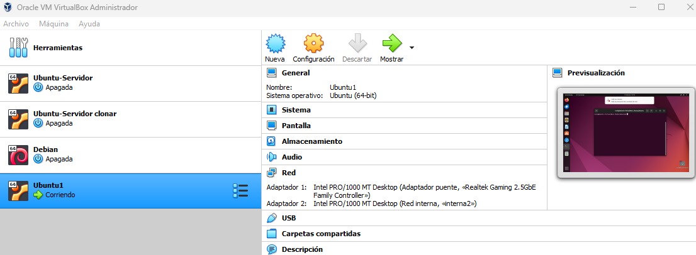
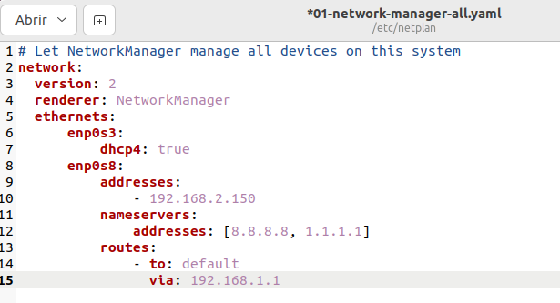
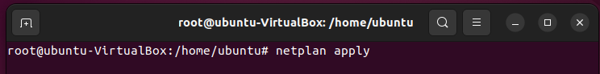

<h1 align="center"> ESQUEMA DE RED </h1>  
 
 

  

## DESCRIPCIÓN DEL ESQUEMA  
El servidor está configurado con dos tarjetas de red:  
- La primera (enp0s3) en adaptador puente.
- La segunda (enp0s8) en red interna.

  

 

## CONFIGURACIÓN DE LAS REDES  
Para la configuración de las redes hay que modificar el archivo
>/etc/netplan/01-network-manager-all.yaml  
- La enp0s3 estará en DHCP.  
- La enp0s8 será IP estática.
  

  

 
Una vez hecha la configuración debemos ejecutar el siguiente comando
 
 

>netplan apply

  

 

