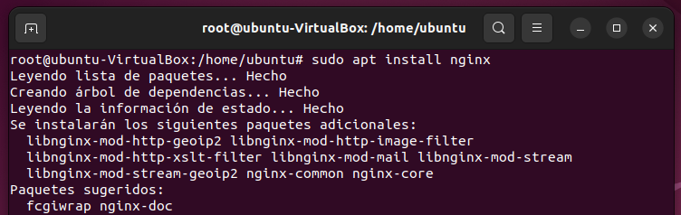

<h1 align="center"> INSTALACIÓN </h1>  
 
 

  

 
 

## Instalación de NGINX 
**Para esta práctica usaremos un Ubuntu version 22.04 para mayor comodidad y simplicidad del sistema operativo.**
 
 
Usaremos el comando
 
>***sudo apt install nginx***

## Verificación del Servicio.
**Mediante el siguiente comando veremos si nuestro servicio nginx esta activo.**
 
 
Usaremos el comando 
 
>***systemctl status nginx***

